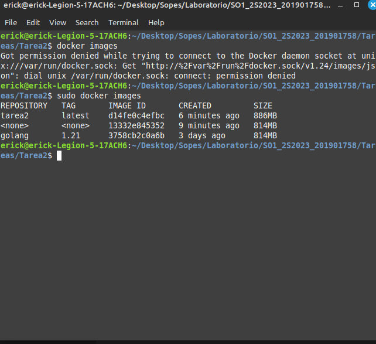
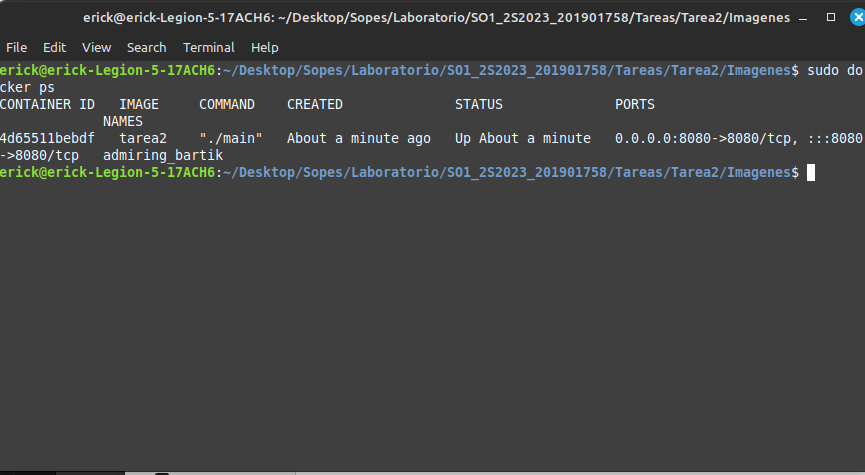
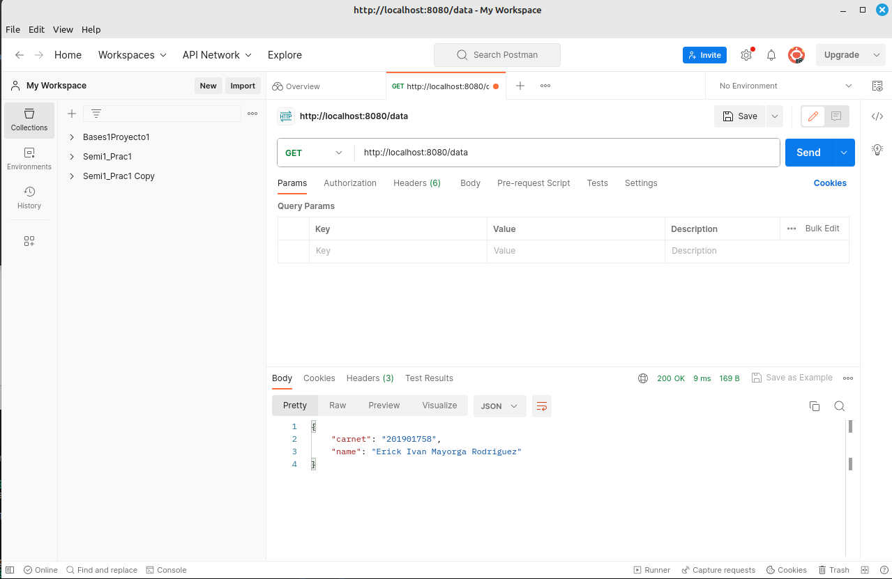

                                sudo docker build -t tarea 2.

                            sudo docker run -p 8080:8080 tarea2

                            sudo docker ps

                         Imagen API consumiendose mediante postman
